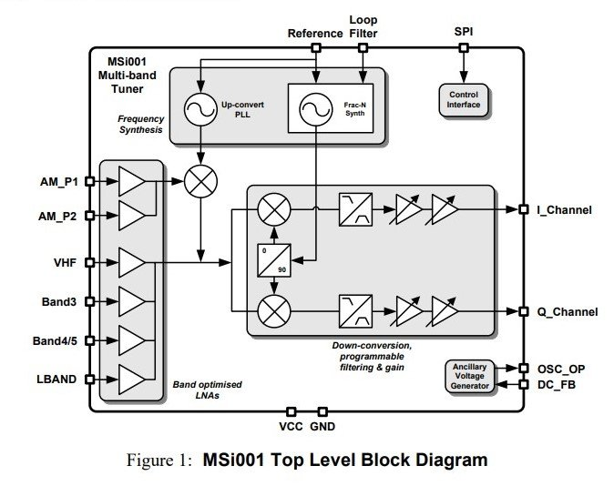
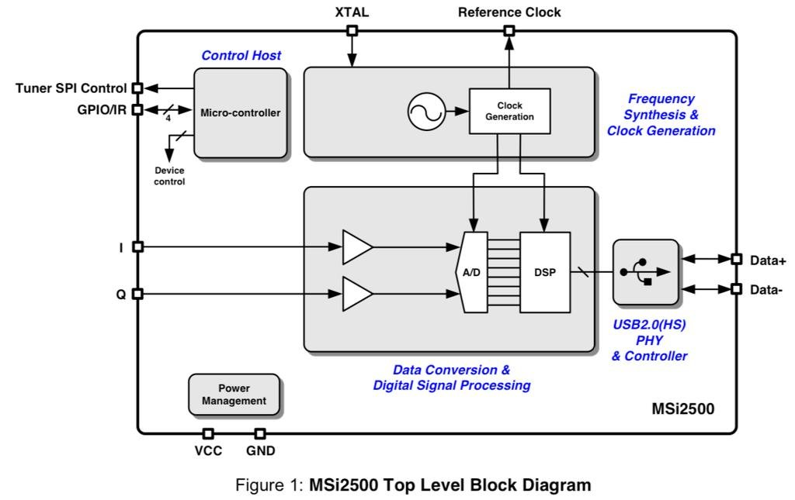
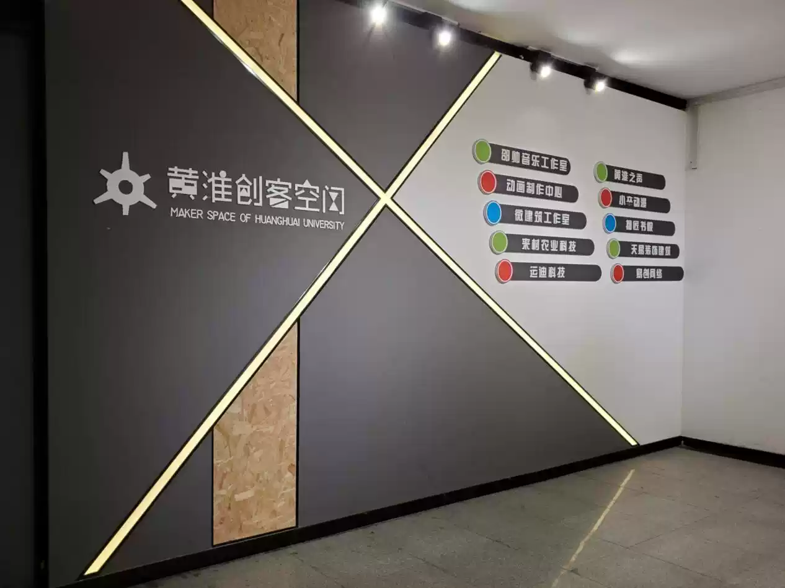

# SDR RSP1: SIMPLIFIED

## DESCRIPTION

(EXPECT THIS TO BE A MESS. It's direct from my research notes!)

"SDR RSP1 Simple" often referred to by "BG7YZF", is a SDRPlay RSP1/RSP1a clone with a simplified circuit. The SDR RSP1 is a redesign of the [MSI.SDR](https://github.com/11tools/msiSDR), a clone of the SDRplay RSP1A. All of these use the Msi001 and the Msi2500 (Sometimes called Msi3001 when used in this combo) chips which according to the vendor the SDR.RSP1 "Based on a simple small production made by Gao Wan"

----------------------

## HARDWARE

In a nutshell, it's a SDR receiver with 5 bandpass filtered antenna inputs and a USB Type-C interface. With no automatic antenna switching, and soldered in-line bandpass filters.

The [msi001](./Datasheets/msi001%20datasheet.pdf) microcircuit contains 5 antenna amplifiers (each for its own range), a synthesizer and quadrature mixers outputting I/Q signals, software-controlled bandpass filters and amplifiers. 

The [msi2500](./Datasheets/msi2500%20datasheet.pdf) is a variable bit (8 to 14 bit) ADC and DSP with USB interface. 

The result is:
- a range from 10 kHz to 1 GHz (with a hole at 250-400 MHz)
- a bandwidth of up to 10 MHz,
MSPS from 2 to 6 MHz (14-bit),
MSPS from 6 to 8 MHz (12-bit),
MSPS from 8 to 9 MHz (10 bits),
MSPS from 9 to 10 MHz (8 bits).
- With a SNR of 60 dB.

the "SDR RSP1" comes in two different models. ["Simple"](https://world.taobao.com/item/647736653771.htm?spm=a21wu.11804641.0.0.508e39d3yTvEJb) and ["Full"](https://www.taobao.com/list/item/645090109900.htm), their antenna circuitry, oscillators and filtering are different. The "Full" is notably better due to being simpler to operate, having a better oscillator and improved filtering. But all of these are design choices to cut costs. Outside the headaches with the Msi001's antenna switching, all other changes done to the "Full" version are entirely possible on the "Simple" version. Some of this can be done by the user if they are experienced in SMP soldering.

----------------------

## FROM THE VENDOR

[Vendor 2](https://world.taobao.com/item/647736653771.htm?spm=a21wu.11804641.0.0.508e39d3yTvEJb) "Question: What is the difference between this(SDR RSP1 Simple) and the full (SDR RSP1 full) version you sell?"
"Answer: The full version uses 0.5PPM TCXO (Oscillators), the frequency is accurate, the simple version only uses ordinary active crystal oscillators with a small offset (not affecting reception), the simple version does not have a casing, and the antenna needs to be switched manually. The simple version is only for usability. Pursue performance. The maximum frequency of the simple version can only reach 1G, you can change it to 2G by yourself(oscillator), because the simple version has a great simplification in the circuit, and it is not as good as the full version in terms of acceptance sensitivity and selectivity, but the two are the same in function Yes ..."

[Vendor 2](https://world.taobao.com/item/647736653771.htm?spm=a21wu.11804641.0.0.508e39d3yTvEJb) "Question: Did you design this yourself, or plagiarize someone else's circuit?"
"Answer: This SDR is an open source project of the foreign SDRPLAY company. The circuit has been simplified by the smith of the domestic science and technology forum. It is also open sourced. Here is the original post [www.kechuang.org/t/83757](www.kechuang.org/t/83757). Please refer to it. I just like radio. , Try to re-engrave it by yourself and add filters in the three bands of 60MHz to 1000Mhz, redesign the PCB layout, modify the interface to Type-C, no copper in the radio frequency area, and add jumper vias to facilitate later toss."

[Vendor 3](https://www.taobao.com/list/item/645090109900.htm) "This (SDR RSP1 Full) full version has the same software functions as the simple version ("SDR RSP1 Simple"), with higher sensitivity and more powerful performance."

----------------------

## ORIGIN

The "SDR RSP1 Simple" design originates from Huanghuai University(MAKER SPACE OF HUANGHUAI UNIVERSITY[香港 创 客 空 闪])(* See HHU), The design originates from research done by a member known as "Smith" on their "Domestic science and technology forum" (See [Design](https://www.kechuang.org/t/83757)). The SDR RSP1's are improvements to these designs by "BG7YZF". A self-described as "a computer science and technology undergraduate student who is engaged in radio, model aircraft, drone, and photography." on their vendor page.

The "DE BG7YZF" silk screen refers to the designer, BG7YZF (a unregistered callsign from China [DXCC Entity #318]) is from QTH Xincai County, Henan Province. [VideoD1](https://www.bilibili.com/video/BV1Co4y1D7R2/) 

The Prefix 'DE' is a Morse code abbreviation amateur radio operators use meaning "from" (See [DE-W](https://en.wikipedia.org/wiki/Amateur_radio_call_signs)). 

The vendor "家晨科創" [Jiachen Technology](https://world.taobao.com/dianpu/573333074.htm?spm=a21wu.12321156.shop-area.1.4170796aFrsOco) seems to be BG7YZF as their callsign is their literal [logo](./Images/vendor/vendor.jpg). Supporting images in the product pages suggest they are the legitimate Vendors of the board(s).

All this information is further reinforced by other silk screens on the board (See images below):

"Maker Space of Huanghuai University" (Self Explanatory)

"Research, Science, Technology and prepare to serve the motherland" (HHU Quote)

and "家晨科创" [https://t.bilibili.com/550480890268977421?tab=2](https://t.bilibili.com/550480890268977421?tab=2) This last one is literally "BG7YZF".

----------------------

### KNOWN CAVEATS

 - Software: As the 'SDR RSP1 Simple' is a modified MSI.SDR RSP1 design (Itself Based on the SDRplay RSP1A), the msi001 and msi2500 chips can natively use SDRplay's proprietary api. However, other projects based on libusb(see mirisdr4) have come along to attempt to interface with the device's raw I/Q stream Using similar methods to the now famous rtlsdr project. However, since the 'RSP1 Simple' is based on the 'RSP1A', i am unaware of how well supported it would be at this moment in time. (See: https://github.com/f4exb/libmirisdr-4/issues/2) 
 
 - Tuning: the SDR RSP1 Simple requires "manual antenna switching"(This is poorly documented!), unlike its "Full" version. As expected from its poorly documented nature, Users report "RSP1 Simple"/"BG7YZF" cannot tune out of FM broadcast frequency range (See: [Ref 1](https://forums.radioreference.com/threads/12-bit-4-antenna-ports-35-delivered.430252/page-2)/[Ref 3](https://www.reddit.com/r/RTLSDR/comments/onftps/any_feedback_on_the_bg7yzf_version_of_the_msi_001/)). Although reports show otherwise (See: Ref 4) | As mentioned, the antennas have to be manually "Switched", The Msi001 is entirely capable of tuning frequency separated antennas, thus its design. However, switching antenna sources seems to be something that has to be done at the msi001(Tuner)'s initialisation. This is all very poorly documented and even the vendor does not  document this properly. Only vaguely mentioning it in an additional "Faq" area at the bottom of their product advert... | I will review and document what i learn when i have more time to understand the issue. I have yet to test the device at all, so i have no idea of its functionality as of yet.
 
 - USB 2.0 Type-C: USB-C interface seems to have several datalines not connected, suggesting it can only achieve USB 2.0 "High-Speed" speeds. While this should be fine (in theory), it may limit bandwidth in some circumstances. The Msi2500's USB Interface is unknown to me at the time of writing, so its suggested it follows USB 1.1/2.0 specifications. limiting many factors including the length of the cable significantly. This is due to power limitations that USB2.0 specification lays out not allowing more than 5v/0.5A(500mA), or 2.5w power draw. This limitation prevents long cable lengths due to the loss experienced at 3M, limiting it to a theoretical maximum of 5m. | Something Usb3.0+ partially overcame with power specification changes. Most importantly this allows for in-line Active USB cables instead of passive, extending length to up to 50M with limited loss. All of this is mute if in fact Msi001 is usb 2.0 only, but if it is capable of 3.0, then the wiring is a design fault for certain.
 
 - Undocumented Variants: Design has Undocumented variants (See: R4-E) as seen in The Ebay listing shared in Reference 4. It shows a model that has different silkscreening and what appears to be slightly different design choices. None of this is documented and the seller shows the device as "New". This may be a clone/counterfeit, But i can't confirm or deny any of this. - No user images have surfaced of this device in use and very little information of SDR RSP1 Simple in use exists in general. While some testing exists of the SDR RSP1 Full, the simplified is overlooked due to its undocumented caveats surround the intenna inputs.
 
 - Case: The SDR RSP1 Simple doesn't have or come with a vendor supplied case. This is a design choice as the "Simple" version is supposed to be an educational kit clearly. However, as case DOES exist from a french maker (https://www.thingiverse.com/thing:4988416)a
 
 
----------------------

## FURTHER IMAGES:

 
--------------------------------------------------------------------------------------

# GLOSSARY

Ref 1: https://forums.radioreference.com/threads/12-bit-4-antenna-ports-35-delivered.430252/page-2 (archived: https://web.archive.org/web/20211124164150/https://forums.radioreference.com/threads/12-bit-4-antenna-ports-35-delivered.430252/page-2)

Ref 2: http://hamforum.ru/viewtopic.php?t=725 (archived: https://web.archive.org/web/20211124164546/http://hamforum.ru/viewtopic.php?t=725)

Ref 3: https://www.reddit.com/r/RTLSDR/comments/onftps/any_feedback_on_the_bg7yzf_version_of_the_msi_001/ (archived: https://web.archive.org/web/20211124182343/https://www.reddit.com/r/RTLSDR/comments/onftps/any_feedback_on_the_bg7yzf_version_of_the_msi_001/)

Ref 4: https://www.reddit.com/r/RTLSDR/comments/qnlfwq/rsp1_chinese_clone_reviewissues/ (archived: https://web.archive.org/web/20211105214824/https://www.reddit.com/r/RTLSDR/comments/qnlfwq/rsp1_chinese_clone_reviewissues/) | the ebay listing and album are archived as well

R4-E: https://www.ebay.com/itm/255106602228 (archived: https://www.ebay.com/itm/255106602228) [Taken from Ref 4's post

R4-A: https://imgur.com/a/kOgz7DM (archived: https://web.archive.org/web/20211118155743/https://imgur.com/a/kOgz7DM) [Taken from Ref 4's post]

Mirisdr4: https://github.com/f4exb/libmirisdr-4 (archived: https://web.archive.org/web/20211124170317/https://github.com/f4exb/libmirisdr-4)

Case: https://www.thingiverse.com/thing:4988416 (archived: https://web.archive.org/web/20211124205033/https://www.thingiverse.com/thing:4988416)

DE-W: https://en.wikipedia.org/wiki/Amateur_radio_call_signs

HHU: http://cms2.huanghuai.edu.cn/s.php/english/item-view-id-21110.html

HHU-2: http://cms2.huanghuai.edu.cn/s.php/english/item-view-id-39020.html

Design: https://www.kechuang.org/t/83757 (archived: https://web.archive.org/web/20211124211743/https://www.kechuang.org/t/83757) *(Translated: https://world.taobao.com/item/647736653771.htm?spm=a21wu.11804641.0.0.508e39d3WbK6VD)

Vendor 1: https://world.taobao.com/dianpu/573333074.htm?spm=a21wu.12321156.shop-area.1.4170796aFrsOco (archived: https://world.taobao.com/dianpu/573333074.htm?spm=a21wu.12321156.shop-area.1.4170796aFrsOco)

Vendor 2: https://world.taobao.com/item/647736653771.htm?spm=a21wu.11804641.0.0.508e39d3yTvEJb (archived: https://web.archive.org/web/20211124164116/https://world.taobao.com/item/647736653771.htm?spm=a21wu.11804641.0.0.508e39d3yTvEJb)

Vendor 3: https://www.taobao.com/list/item/645090109900.htm (archived: https://web.archive.org/web/20211124164116/https://www.taobao.com/list/item/645090109900.htm)

VideoD1: https://www.bilibili.com/video/BV1Co4y1D7R2/ (archived: https://web.archive.org/web/20211124164152/https://www.bilibili.com/video/BV1Co4y1D7R2/)
